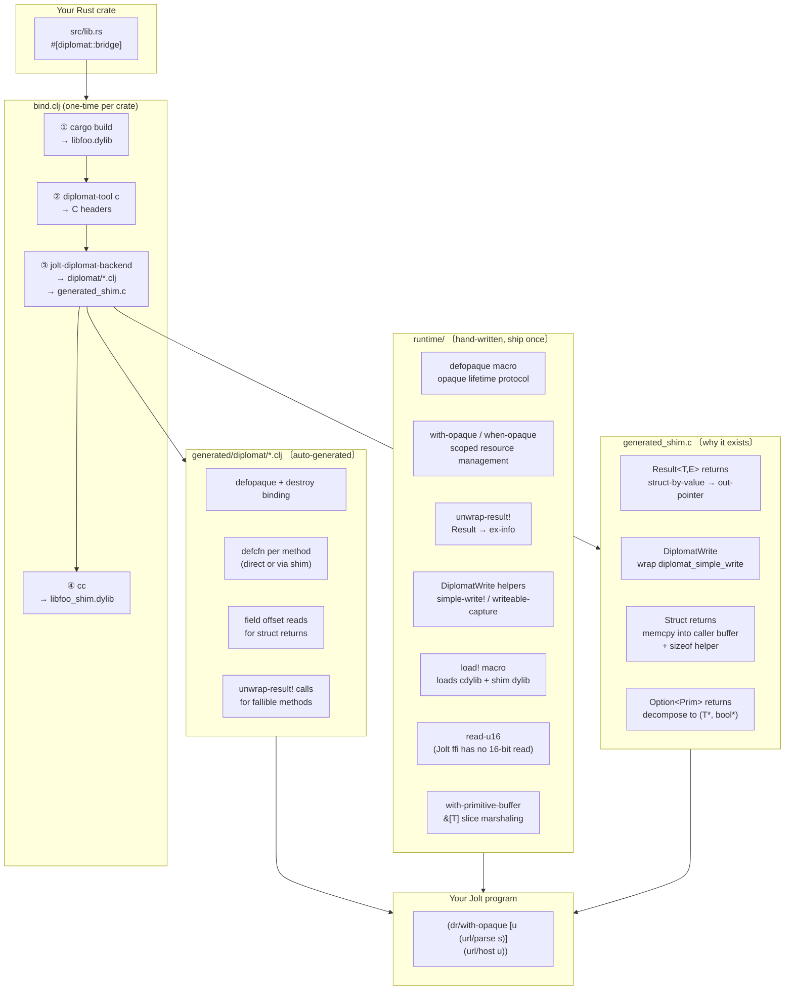

# jolt-diplomat

Call Rust libraries from [Jolt](https://jolt-lang.net) using [Diplomat](https://diplomatoptic.com) as the FFI bridge.

One script (`bind.clj`) takes any Diplomat-annotated Rust crate and produces ready-to-use Jolt bindings. A small hand-written runtime library handles the lifetime and marshaling conventions that Diplomat's C ABI requires.

## Architecture



### Why the shim exists

Diplomat's C backend emits several ABI shapes that Jolt's `ffi/defcfn` cannot express directly:

| Shape | Problem | Shim solution |
|---|---|---|
| `Result<T,E>` | Returned as a named struct by value; no struct-by-value return in Jolt ffi | Shim takes an out-pointer, writes the struct through it |
| `DiplomatWrite` | `diplomat_simple_write` returns `DiplomatWrite` by value (56 bytes) | Shim wraps it with an out-pointer |
| Struct returns | Any `-> MyStruct` crosses as struct-by-value | Shim `memcpy`s into caller buffer; sizeof helper lets Jolt allocate the right size |
| `Option<Prim>` | C ABI is a per-function `{T ok; bool is_ok}` result struct | Shim decomposes to `(T* out_val, bool* out_is_ok)` |

### What the runtime handles

| Concern | Why it can't be generated |
|---|---|
| Opaque lifetime (`with-opaque`, `when-opaque`) | Scoping convention, not derivable from a single type's API |
| `unwrap-result!` | Common across all fallible methods; one copy is better than N |
| `read-u16` | Jolt ffi has no 16-bit `foreign-ref` type; two `uint8` reads + `bit-or` |
| `with-primitive-buffer` | `&[T]` marshaling is identical for every slice param regardless of type |
| `load!` | Loads both the cdylib and shim dylib in one call |

## Layout

```
jolt-diplomat/
├── runtime/          — Jolt library; add as :local/root or :git/url dep
├── backend/          — Rust generator (jolt-diplomat-backend)
├── macros/           — proc-macro attributes (#[jolt_diplomat::blocking], etc.)
├── bind.clj          — full pipeline: cargo → diplomat-tool → generator → cc
└── examples/
    ├── url/          — url crate: nullable prim, struct return, fallible
    │   └── leak-check/   — AllocStats-based leak check (see Memory-leak checking below)
    ├── regex/        — regex crate: nullable write, opaque error
    │   └── leak-check/
    ├── semver/       — semver crate: cross-opaque method params
    │   └── leak-check/
    ├── base64/       — base64 + hex: &[u8] slice params
    │   └── leak-check/
    ├── json/         — serde_json: nullable opaque, enum return
    │   └── leak-check/
    ├── chrono/       — chrono: struct return with mixed field types
    │   └── leak-check/
    ├── markdown/     — pulldown-cmark: struct-by-value param, plain scalar returns
    │   └── leak-check/
    ├── callback/     — impl Fn(...) params: Jolt closures called from Rust
    │   └── leak-check/
    ├── sdl3/         — SDL3 window/renderer: bouncing-box GUI with mouse interaction
    │   └── leak-check/
    └── tantivy/      — tantivy full-text search: blocking commit, opaque chain, ResultSet accessors
        └── leak-check/
```

## Usage

### 1. Set up the crate

```toml
# my_capi/Cargo.toml
[package]
name = "my_capi"
version = "0.1.0"
edition = "2021"

[lib]
name = "my_capi"
crate-type = ["cdylib"]

[dependencies]
diplomat = ">=0.10,<0.16"
diplomat-runtime = ">=0.10,<0.16"
```

```rust
// my_capi/src/lib.rs
#[diplomat::bridge]
mod ffi {
    use diplomat_runtime::DiplomatWrite;
    use std::fmt::Write as _;

    #[diplomat::opaque]
    pub struct MyType(inner::MyType);

    #[diplomat::opaque]
    pub struct MyError(String);

    impl MyError {
        // Required whenever an opaque is used as a Result's error type —
        // the generator always emits a call to this (see Known limitations
        // below), so a fallible method whose error type lacks it produces
        // a binding that fails at first call, not at generation time.
        pub fn message(&self, write: &mut DiplomatWrite) {
            let _ = write.write_str(&self.0);
        }
    }

    impl MyType {
        pub fn parse(s: &str) -> Result<Box<MyType>, Box<MyError>> { ... }
        pub fn value(&self) -> u32 { ... }
    }
}
```

### 2. Run bind.clj

```bash
./bind.clj path/to/my_capi --release
```

Outputs: `generated/diplomat/*.clj`, `generated/generated_shim.c`, `libmy_capi_shim.dylib`.

### 3. Add runtime dep

```edn
; deps.edn
{:paths ["src" "../generated"]
 :deps {jolt-diplomat-runtime/jolt-diplomat-runtime
        {:local/root "../../../runtime"}}}
```

### 4. Call from Jolt

```clojure
(require '[diplomat.runtime :as dr])
(dr/load! demo-dir "my_capi")
(require '[diplomat.my-type :as mt])

(dr/with-opaque [x (mt/parse "hello")]
  (println (mt/value x)))
```

### If a method genuinely blocks (I/O, a lock, a sleep)

Add `jolt-diplomat-macros` to your crate and annotate the method — the generated binding gets `jolt.ffi`'s `:blocking` flag, so the call doesn't pin the garbage collector for every other thread while it waits:

```toml
# my_capi/Cargo.toml
[dependencies]
jolt-diplomat-macros = { git = "https://github.com/yourorg/jolt-diplomat" }
```

```rust
use jolt_diplomat::blocking;

impl MyType {
    #[jolt_diplomat::blocking]
    pub fn save(&self, path: &str) -> Result<(), Box<MyError>> { ... }
}
```

Skip this for everything else — most methods (parsing, math, data transforms) are fast enough that it isn't worth the overhead. A `&str`/`String` param works fine on a blocking method (the generator routes it through a foreign-allocated buffer automatically) — see Known limitations below for why that's necessary.

## Running the examples

### Prerequisites

**Rust toolchain**
```bash
curl --proto '=https' --tlsv1.2 -sSf https://sh.rustup.rs | sh
```

**diplomat-tool** (must be 0.14–0.15; 0.16+ changes the HIR and is not yet supported)
```bash
cargo install diplomat-tool --version "^0.15"
```

**Jolt** v0.8.4+  
Follow the [Jolt install guide](https://jolt-lang.net/docs/install.html). Verify with:
```bash
jolt --version   # should print v0.8.4 or later
```

**C compiler** — on macOS install Xcode Command Line Tools if not already present:
```bash
xcode-select --install
```

### Build an example

Each example ships with pre-generated bindings and a pre-compiled shim dylib, so for a quick run you only need Jolt:

```bash
cd examples/chrono/jolt-project
jolt run -m demo
```

To rebuild from source (e.g. after modifying the Rust crate):

```bash
cd examples/chrono
../../bind.clj chrono_capi   # runs the full pipeline: cargo → diplomat-tool → generator → cc
cd jolt-project
jolt run -m demo
```

### All examples at once

```bash
for demo in url regex semver base64 json chrono markdown callback tantivy; do
  echo "=== $demo ==="
  (cd examples/$demo/jolt-project && jolt run -m demo)
done
```

`sdl3` opens a window and runs its own event loop — run it on its own, not in the batch loop above:

```bash
(cd examples/sdl3/jolt-project && jolt run -m demo)
```

### What each example demonstrates

| Example | Rust crate | Key ABI shapes |
|---|---|---|
| `url` | [`url`](https://crates.io/crates/url) | fallible ctor, `Option<u16>` return, struct return |
| `regex` | [`regex`](https://crates.io/crates/regex) | nullable write, opaque error type |
| `semver` | [`semver`](https://crates.io/crates/semver) | cross-opaque method params |
| `base64` | [`base64` + `hex`](https://crates.io/crates/base64) | `&[u8]` slice params |
| `json` | [`serde_json`](https://crates.io/crates/serde_json) | nullable opaque return, enum return |
| `chrono` | [`chrono`](https://crates.io/crates/chrono) | struct return with mixed field types, nullable opaque |
| `markdown` | [`pulldown-cmark`](https://crates.io/crates/pulldown-cmark) | struct-by-value param with real behavioral effect, plain scalar returns |
| `callback` | (synthetic `Reducer`) | `impl Fn(...)` params — Jolt closures called back into from Rust |
| `sdl3` | [`sdl3`](https://crates.io/crates/sdl3) | windowed GUI with mouse interaction driven entirely from Jolt |
| `tantivy` | [`tantivy`](https://crates.io/crates/tantivy) | blocking commit, opaque `SearchIndex→ResultSet` chain, per-hit accessor pattern |

## Memory-leak checking

Every example under `examples/` ships a `leak-check/` subproject that exercises the crate's bound API at volume and reports whether every byte the crate allocates gets deallocated — an exact yes/no answer per run, not an inferred one.

### Why not just watch process memory?

The first version of this tooling sampled process RSS (`ps -o rss=`) and Chez's own `(current-memory-bytes)` before and after a loop. Two problems killed that approach:

- **Chez's GC-heap stats never see Rust-side allocations.** An undestroyed `Box<Codec>` from a forgotten `close!` lives in native/malloc memory Chez's collector doesn't track at all — `current-memory-bytes` stayed perfectly flat across a run that was leaking hundreds of KB.
- **RSS does see it, but noisily.** RSS growth is a real signal for a native leak, but distinguishing "20MB of steady leak" from "20MB of one-time startup/JIT noise" needs threshold-tuning, warm-up windows, and multiple samples — and the right threshold for a small `Codec` struct (base64) turned out ten times too coarse for `JsonValue`'s smaller per-leak footprint (json), so it wasn't even a threshold you could set once and reuse.

### The actual solution: `stats_alloc`

Each example's `*_capi` crate gets a `mem-trace` Cargo feature. Behind that feature, `stats_alloc` replaces the crate's global allocator, and an `AllocStats` opaque exposes two counters back to Jolt:

```rust
#[cfg(feature = "mem-trace")]
#[global_allocator]
static GLOBAL: &StatsAlloc<System> = &INSTRUMENTED_SYSTEM;

#[cfg(feature = "mem-trace")]
#[diplomat::opaque]
pub struct AllocStats;

#[cfg(feature = "mem-trace")]
impl AllocStats {
    pub fn bytes_allocated() -> u64 { super::GLOBAL.stats().bytes_allocated as u64 }
    pub fn bytes_deallocated() -> u64 { super::GLOBAL.stats().bytes_deallocated as u64 }
}
```

(`AllocStats` is an opaque with static methods, not a bare function, because this repo's jolt-diplomat backend doesn't lower Diplomat free functions yet.)

A leak-check script does a warm-up, snapshots `bytes_allocated - bytes_deallocated`, runs N iterations of the real API, and snapshots again. Any nonzero delta is bytes that were allocated and never freed — exact, deterministic, no averaging, no noise floor:

```clojure
(defn live-bytes [] (- (as/bytes-allocated) (as/bytes-deallocated)))
;; ... warm up, snapshot baseline, run N iterations, snapshot again ...
;; leaked = after - baseline
```

### Why two builds instead of one

`diplomat-tool` and this repo's Jolt-side generator both parse `src/lib.rs` **textually** — neither runs cargo's feature/`cfg` resolution. That means a `#[cfg(feature = "mem-trace")]`-gated `AllocStats` is always visible to codegen, regardless of which Cargo features the `.dylib` was actually compiled with. Generating bindings once against a default (non-traced) build would silently produce Clojure code that calls a symbol the dylib doesn't export.

So `bind.clj` gained two flags to keep the two builds fully separate:

```bash
# consumable build: generated/, target/, no AllocStats surface at all
./bind.clj my_capi --release

# traced build: generated-traced/, target-traced/ (own CARGO_TARGET_DIR), AllocStats present
./bind.clj my_capi --release --features mem-trace --out-suffix -traced
```

`--out-suffix` isolates *everything* per build — `c-headers<suffix>/`, `generated<suffix>/`, the shim dylib name, and (critically) `CARGO_TARGET_DIR`, so the traced and untraced `.dylib`s coexist on disk instead of one build overwriting the other's artifact at the same path.

The result: real consumers get a cdylib with zero tracing overhead and no `AllocStats` symbol at all; `leak-check/` loads the traced build directly via `jolt.ffi/load-library` (not the `dr/load!` macro, which assumes the untraced path layout).

### Running a leak check

```bash
cd examples/chrono/leak-check
jolt run -m leak-check       # exercises the real API; expect "leaked: 0 bytes"
jolt run -m leak-check-neg   # deliberately skips close! on an opaque; expect a nonzero, deterministic leak
```

Every example's `leak-check/` has both files: `leak_check.clj` proves the crate's real usage pattern doesn't leak, and `leak_check_neg.clj` proves the check isn't just silent — it deliberately breaks `with-opaque`/`when-opaque` discipline (the specific mistake shape that crate's opaque graph actually invites — a flat forgotten `close!` for a single-opaque crate like `base64`/`chrono`, a forgotten nested owned-opaque for `json`'s `array_get`-shaped return, a leaked borrowed-looking-but-actually-owned argument for `semver`'s two-opaque `matches` call, and so on) and confirms a real, nonzero, repeatable byte count comes back.

### Where the pattern had to bend

Most examples wrap a pure data-transform crate (a single opaque, cheap to construct, no real OS resources), so the same 500-round-warmup / 20000-iteration shape works everywhere. Two examples didn't fit that mold:

- **`tantivy`** — building a `SearchIndex` is expensive (a real `tantivy::Index`/`IndexWriter`/`IndexReader`, a `Mutex`, a 50MB writer buffer). `leak_check.clj` builds *one* index up front and loops the actual leak risk — `search()`'s owned `ResultSet` return and its accessors — 20000 times against it, rather than rebuilding the index every iteration.
- **`sdl3`** — `SdlApp::create` opens a real OS window and `AudioStream::open` grabs the real default audio device on every call, not a cheap in-process value. Its `leak-check/` uses 30 iterations instead of 20000, run once and meant to be observed directly (brief window flashing is expected), and its negative control can only leak a *single* instance — `sdl3::EventPump` is a process-wide singleton the crate itself enforces, so a second unclosed `create` throws instead of accumulating. That failure became a second, independent confirmation of the leak alongside the byte count.
- **`callback`** — has no opaque that needs closing at all (`Reducer::reduce`/`apply_twice` run their closure inline and return nothing owned). The real leak risk lives in Diplomat's callback marshaling: a boxed `impl Fn` trait object on the Rust side (which `AllocStats` **can** see), and a Chez-side `jolt.ffi/foreign-callable` trampoline pair on the Jolt side (which it **cannot** — that's Chez-owned foreign memory, and `jolt.ffi` exposes no live-callable counter). `callback_capi` has a `apply_twice_leaky` method that exists solely as a test fixture (`Box::leak`s the closure) so the negative control has something real to detect; the Chez-side half of this crate's leak risk remains unverified by any tool in this repo.

### Known gaps

- **`callback`'s Chez-side trampoline leak is undetectable** with current tooling — no `jolt.ffi` introspection exists for live foreign-callables.
- **`sdl3`'s `SdlApp` has no `Drop` impl**, so a loaded TTF font (and the `TTF_Init` call) is never released. `leak_check.clj` deliberately avoids `load_font` so the check measures what's currently correct rather than a known-broken path.

## Requirements

- Rust + Cargo
- `diplomat-tool` 0.14–0.15 (`cargo install diplomat-tool --version "^0.15"`)
- [Jolt](https://jolt-lang.net) v0.8.4+
- `cc` (Xcode CLT on macOS)

## Known limitations

- Struct-by-value **params** support primitive, enum, `Option<primitive/enum>`, and nested-struct fields (flattened recursively to scalars at the FFI boundary). Struct-by-value **returns** support the same except `Option<...>` fields — the generator rejects those loudly rather than silently dropping them from the returned Clojure map.
- `impl Fn(...)` callback params support primitive-in/primitive-out signatures only, invoked synchronously during the call and freed right after — see `examples/callback`. This matches Diplomat's own callback design; it isn't a shape for handing Jolt a long-lived handle into live Rust state (e.g. it can't express something like `egui`'s closure-based, mutably-borrowed UI builder API).
- Owned slice params (`Box<[T]>`, `Vec<String>`) aren't supported — Diplomat's own C backend doesn't support owned primitive slices either, and this generator doesn't support owned string slices.
- **An opaque used as a fallible method's error type must implement `message(&self, write: &mut DiplomatWrite)`.** The generator always emits a call to `{error-type}/message` when unwrapping a `Result` whose error is an opaque — it doesn't check whether that method actually exists on the Rust side. An error type missing it compiles and generates fine, then fails the first time that fallible method is actually called (`No such var: ...error/message`), not at generation time. Every error type in `examples/` defines this method; follow that pattern for your own.
- Marking a method `#[jolt_diplomat::blocking]` (see Usage above) is safe with any param shape, including `&str`/`String` — the generator automatically routes a blocking method's string params through a foreign-allocated buffer instead of a bare `:string` arg, since `jolt.ffi`'s `:blocking` calling convention (Chez's `__collect_safe`) rejects `:string` outright for GC-safety reasons. If you ever see a generation-time panic mentioning `:string argument`, it means some other param shape reached `:blocking` without going through that routing — file it as a bug against this generator.
- Tested against `diplomat-tool`/`diplomat_core` 0.10–0.15; 0.16 changes the HIR shape in ways not yet accounted for.

## License

MIT — see [LICENSE](LICENSE).
