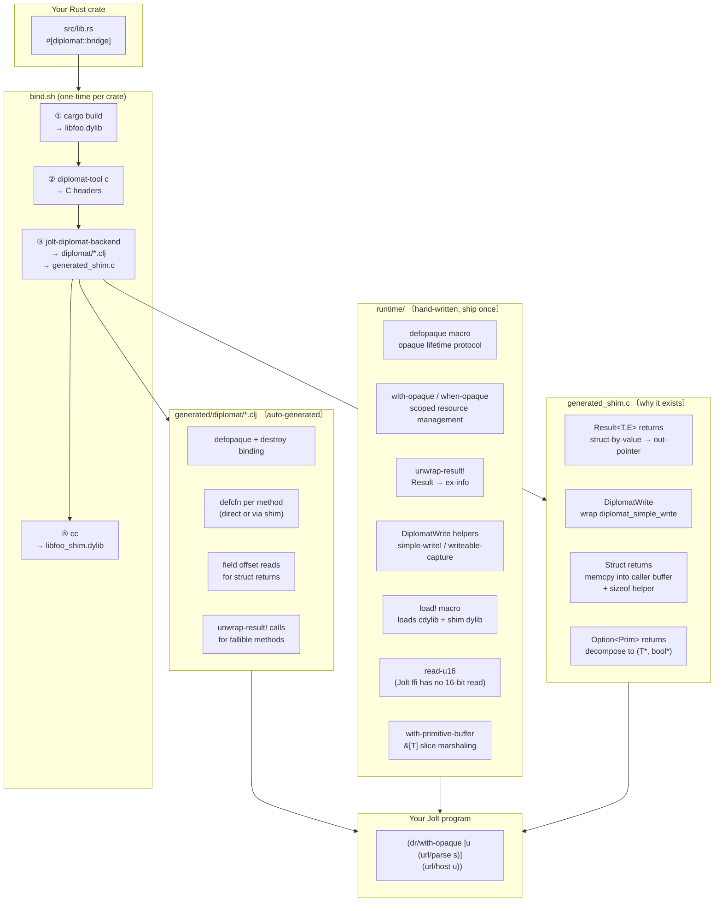

# jolt-diplomat

Call Rust libraries from [Jolt](https://jolt-lang.net) using [Diplomat](https://diplomatoptic.com) as the FFI bridge.

One script (`bind.sh`) takes any Diplomat-annotated Rust crate and produces ready-to-use Jolt bindings. A small hand-written runtime library handles the lifetime and marshaling conventions that Diplomat's C ABI requires.

## Architecture



### Why the shim exists

Diplomat's C backend emits several ABI shapes that Jolt's `ffi/defcfn` cannot express directly:

| Shape | Problem | Shim solution |
|---|---|---|
| `Result<T,E>` | Returned as a named struct by value; no struct-by-value return in Jolt ffi | Shim takes an out-pointer, writes the struct through it |
| `DiplomatWrite` | `diplomat_simple_write` returns `DiplomatWrite` by value (56 bytes) | Shim wraps it with an out-pointer |
| Struct returns | Any `-> MyStruct` crosses as struct-by-value | Shim `memcpy`s into caller buffer; sizeof helper lets Jolt allocate the right size |
| `Option<Prim>` | C ABI is a per-function `{T ok; bool is_ok}` result struct | Shim decomposes to `(T* out_val, bool* out_is_ok)` |

### What the runtime handles

| Concern | Why it can't be generated |
|---|---|
| Opaque lifetime (`with-opaque`, `when-opaque`) | Scoping convention, not derivable from a single type's API |
| `unwrap-result!` | Common across all fallible methods; one copy is better than N |
| `read-u16` | Jolt ffi has no 16-bit `foreign-ref` type; two `uint8` reads + `bit-or` |
| `with-primitive-buffer` | `&[T]` marshaling is identical for every slice param regardless of type |
| `load!` | Loads both the cdylib and shim dylib in one call |

## Layout

```
jolt-diplomat/
├── runtime/          — Jolt library; add as :local/root or :git/url dep
├── backend/          — Rust generator (jolt-diplomat-backend)
├── bind.sh           — full pipeline: cargo → diplomat-tool → generator → cc
└── examples/
    ├── url/          — url crate: nullable prim, struct return, fallible
    ├── regex/        — regex crate: nullable write, opaque error
    ├── semver/       — semver crate: cross-opaque method params
    ├── base64/       — base64 + hex: &[u8] slice params
    ├── json/         — serde_json: nullable opaque, enum return
    └── chrono/       — chrono: struct return with mixed field types
```

## Usage

### 1. Annotate your crate

```rust
#[diplomat::bridge]
mod ffi {
    #[diplomat::opaque]
    pub struct MyType(inner::MyType);

    impl MyType {
        pub fn parse(s: &str) -> Result<Box<MyType>, Box<MyError>> { ... }
        pub fn value(&self) -> u32 { ... }
    }
}
```

### 2. Run bind.sh

```bash
bash bind.sh path/to/my_capi --release
```

Outputs: `generated/diplomat/*.clj`, `generated/generated_shim.c`, `libmy_capi_shim.dylib`.

### 3. Add runtime dep

```edn
; deps.edn
{:paths ["src" "../generated"]
 :deps {jolt-diplomat-runtime/jolt-diplomat-runtime
        {:local/root "../../../runtime"}}}
```

### 4. Call from Jolt

```clojure
(require '[diplomat.runtime :as dr])
(dr/load! demo-dir "my_capi")
(require '[diplomat.my-type :as mt])

(dr/with-opaque [x (mt/parse "hello")]
  (println (mt/value x)))
```

## Requirements

- Rust + Cargo
- [`diplomat-tool`](https://github.com/rust-diplomat/diplomat) (`cargo install diplomat-tool`)
- [Jolt](https://jolt-lang.net) v0.7+
- `cc` (Xcode CLT on macOS)
